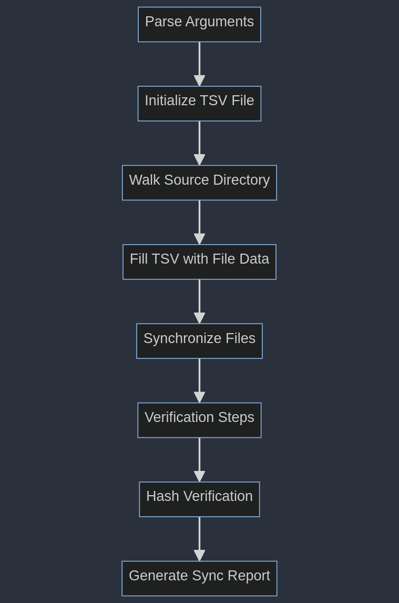
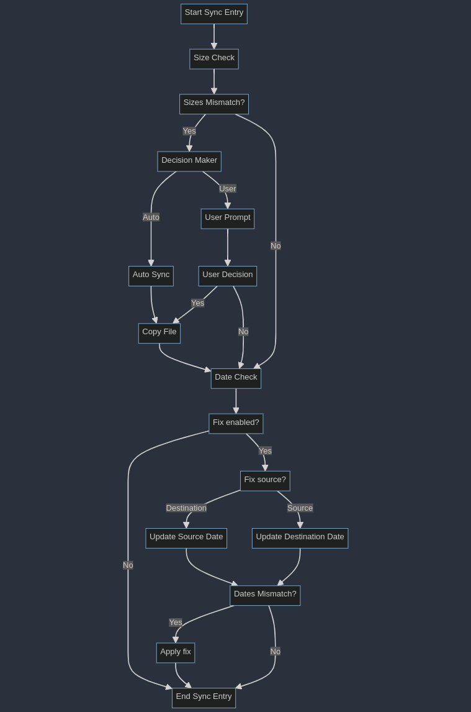

# Introduction

This Python script is designed to synchronize files between a source directory and a destination directory. It's implemented in a single file to simplify deployment and usage.

# Features

- **Decision Making**: Choose between automatic syncing or manual user decisions for file conflicts.
- **Date Modification Correction**: Options to fix date modifications on files either in the source or destination directory.
- **Verification**: Verify file integrity through size comparison and optional hash checks.
- **Concurrency**: Supports both serial and parallel processing to optimize performance.
- **Customizable Thread Count**: Allows specification of the number of threads for parallel processing.

# Installation

Download the Python script to your local machine and ensure Python is installed on your system to execute the script, as it's the only external dependency.

# Usage

## Parameters

- `source_directory`: Specifies the source directory from which to sync files.
- `destination_directory`: Specifies the target directory to which files will be synced.
- `--decision_maker (-dm)`: Sets the conflict resolution mode (`user` for manual resolution or `auto` for automatic), with `auto` being the default.
- `--date_modified_fix_source (-dmfs)`: Chooses the directory (`source_directory` or `destination_directory`) whose file modification dates are to be used for synchronization, with `destination_directory` as the default.
- `--date_modified_fix_enabled (-dmfe)`: Toggles the date modification fix feature on or off, with it being enabled by default.
- `--verify_steps (-vs)`: Sets the number of verification steps, with the default set to 0.
- `--verify_hash (-vh)`: Turns on hash verification for a more thorough integrity check, though it is off by default.
- `--parallel_processing_mode (-ppm)`: Enables or disables parallel processing, with it being disabled by default or if manual resolution mode is used.
- `--threads_count (-tc)`: Determines the number of threads to use for parallel processing, with 8 threads as the default.

## Commands

Execute the script from the command line, providing the required directories and any optional parameters:

```bash
python -O thesync.py <source_directory> <destination_directory> [options]
```

# How It Works

## Sync Logic



## Sync Conflict Resolution



# License

MIT
